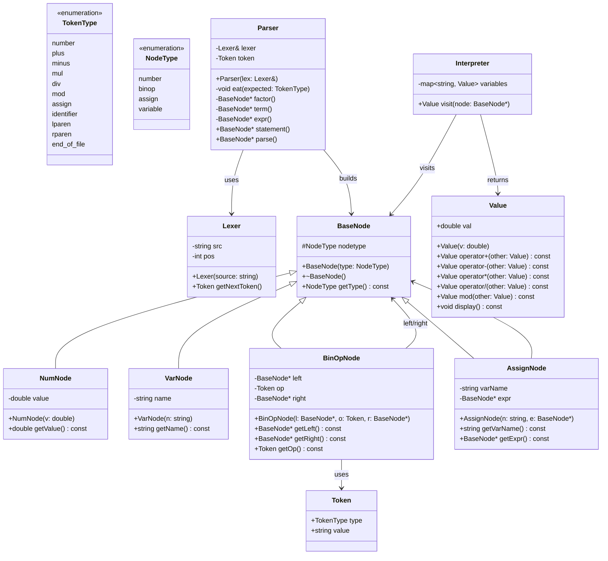

```mermaid
classDiagram
direction TB

%% ---------- ENUMS ----------
class TokenType {
    <<enumeration>>
    number
    plus
    minus
    mul
    div
    mod
    assign
    identifier
    lparen
    rparen
    end_of_file
}

class NodeType {
    <<enumeration>>
    number
    binop
    assign
    variable
}

%% ---------- STRUCTS ----------
class Token {
    +TokenType type
    +string value
}

%% ---------- CLASSES ----------
class Lexer {
    -string src
    -int pos
    +Lexer(source: string)
    +Token getNextToken()
}

class BaseNode {
    #NodeType nodetype
    +BaseNode(type: NodeType)
    +~BaseNode()
    +NodeType getType() const
}

class NumNode {
    -double value
    +NumNode(v: double)
    +double getValue() const
}

class VarNode {
    -string name
    +VarNode(n: string)
    +string getName() const
}

class BinOpNode {
    -BaseNode* left
    -Token op
    -BaseNode* right
    +BinOpNode(l: BaseNode*, o: Token, r: BaseNode*)
    +BaseNode* getLeft() const
    +BaseNode* getRight() const
    +Token getOp() const
}

class AssignNode {
    -string varName
    -BaseNode* expr
    +AssignNode(n: string, e: BaseNode*)
    +string getVarName() const
    +BaseNode* getExpr() const
}

class Parser {
    -Lexer& lexer
    -Token token
    +Parser(lex: Lexer&)
    -void eat(expected: TokenType)
    -BaseNode* factor()
    -BaseNode* term()
    -BaseNode* expr()
    +BaseNode* statement()
    +BaseNode* parse()
}

class Value {
    +double val
    +Value(v: double)
    +Value operator+(other: Value) const
    +Value operator-(other: Value) const
    +Value operator*(other: Value) const
    +Value operator/(other: Value) const
    +Value mod(other: Value) const
    +void display() const
}

class Interpreter {
    -map~string, Value~ variables
    +Value visit(node: BaseNode*)
}

%% ---------- INHERITANCE ----------
BaseNode <|-- NumNode
BaseNode <|-- VarNode
BaseNode <|-- BinOpNode
BaseNode <|-- AssignNode

%% ---------- RELATIONSHIPS ----------
Parser --> Lexer : uses
Parser --> BaseNode : builds
Interpreter --> BaseNode : visits
Interpreter --> Value : returns
BinOpNode --> Token : uses
BinOpNode --> BaseNode : left/right
AssignNode --> BaseNode : expr
```
