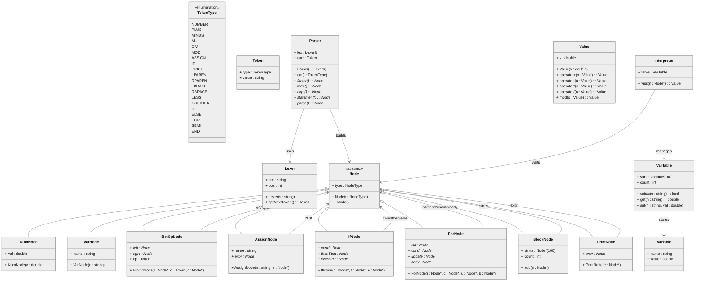

```mermaid
%%{init: {'theme': 'neutral'}}%%
classDiagram

%% -------------------------------
%% ENUMS AND BASIC STRUCTURES
%% -------------------------------
class TokenType {
    <<enumeration>>
    NUMBER
    PLUS
    MINUS
    MUL
    DIV
    MOD
    ASSIGN
    ID
    PRINT
    LPAREN
    RPAREN
    LBRACE
    RBRACE
    LESS
    GREATER
    IF
    ELSE
    FOR
    SEMI
    END
}

class Token {
    + type : TokenType
    + value : string
}

%% -------------------------------
%% LEXER
%% -------------------------------
class Lexer {
    + src : string
    + pos : int
    + Lexer(s : string)
    + getNextToken() : Token
}

%% -------------------------------
%% NODE HIERARCHY
%% -------------------------------
class Node {
    <<abstract>>
    + type : NodeType
    + Node(t : NodeType)
    + ~Node()
}

class NumNode {
    + val : double
    + NumNode(v : double)
}

class VarNode {
    + name : string
    + VarNode(n : string)
}

class BinOpNode {
    + left : Node*
    + right : Node*
    + op : Token
    + BinOpNode(l : Node*, o : Token, r : Node*)
}

class AssignNode {
    + name : string
    + expr : Node*
    + AssignNode(n : string, e : Node*)
}

class IfNode {
    + cond : Node*
    + thenStmt : Node*
    + elseStmt : Node*
    + IfNode(c : Node*, t : Node*, e : Node*)
}

class ForNode {
    + init : Node*
    + cond : Node*
    + update : Node*
    + body : Node*
    + ForNode(i : Node*, c : Node*, u : Node*, b : Node*)
}

class BlockNode {
    + stmts : Node*[100]
    + count : int
    + add(n : Node*)
}

class PrintNode {
    + expr : Node*
    + PrintNode(e : Node*)
}

%% -------------------------------
%% PARSER
%% -------------------------------
class Parser {
    + lex : Lexer&
    + curr : Token
    + Parser(l : Lexer&)
    + eat(t : TokenType)
    + factor() : Node*
    + term() : Node*
    + expr() : Node*
    + statement() : Node*
    + parse() : Node*
}

%% -------------------------------
%% VALUES AND VARIABLES
%% -------------------------------
class Value {
    + v : double
    + Value(x : double)
    + operator+(o : Value) : Value
    + operator-(o : Value) : Value
    + operator*(o : Value) : Value
    + operator/(o : Value) : Value
    + mod(o : Value) : Value
}

class Variable {
    + name : string
    + value : double
}

class VarTable {
    + vars : Variable[100]
    + count : int
    + exists(n : string) : bool
    + get(n : string) : double
    + set(n : string, val : double)
}

%% -------------------------------
%% INTERPRETER
%% -------------------------------
class Interpreter {
    + table : VarTable
    + visit(n : Node*) : Value
}

%% -------------------------------
%% RELATIONSHIPS
%% -------------------------------
Node <|-- NumNode
Node <|-- VarNode
Node <|-- BinOpNode
Node <|-- AssignNode
Node <|-- IfNode
Node <|-- ForNode
Node <|-- BlockNode
Node <|-- PrintNode

Parser --> Lexer : uses
Parser --> Node : builds
Interpreter --> Node : visits
Interpreter --> VarTable : manages
VarTable --> Variable : stores
BinOpNode --> Node : left/right
AssignNode --> Node : expr
IfNode --> Node : cond/then/else
ForNode --> Node : init/cond/update/body
BlockNode --> Node : stmts
PrintNode --> Node : expr

```
